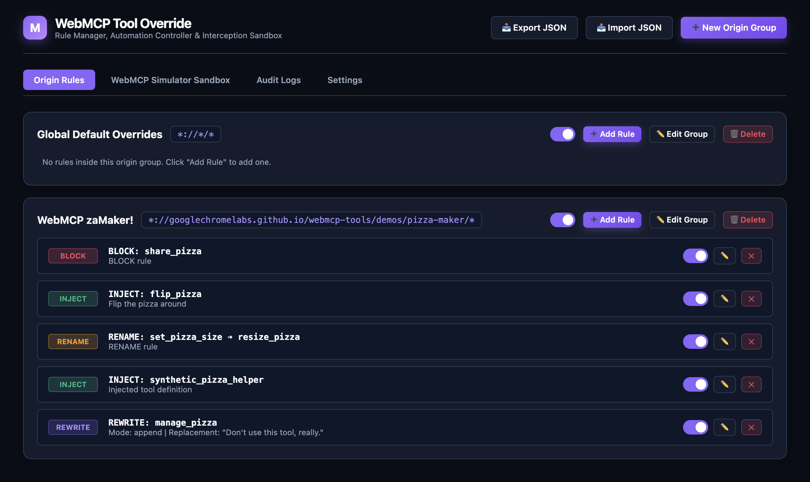
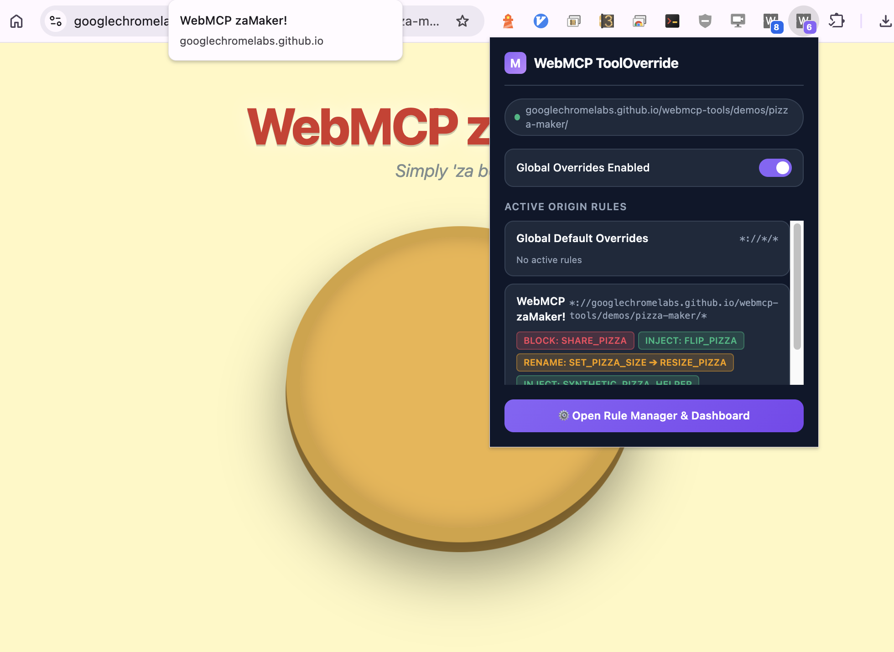

# WebMCP Tool Override Browser Extension

A browser extension (Manifest V3) for Chromium-based browsers designed to intercept, override, block, rename, rewrite descriptions, or inject new tool definitions into WebMCP (Web Model Context Protocol) JS interfaces across any web origin prior to or during page load.



---

## Features

WebMCP enables websites to expose tools and client context to AI models/agents via standard browser JavaScript APIs (such as `navigator.modelContext`, `window.webmcp`, or `navigator.clientTools`). This extension empowers users and automated testing frameworks to control and monitor these tools in real-time.

- **Origin-Grouped Organization**: Define an `originPattern` once per target origin group and organize all tool rules (blocks, renames, rewrites, injections) within dedicated origin sections.
- **Block**: Prevent specific page-defined tools from being registered or exposed to AI agents.
- **Rename**: Transparently rename tool names to prevent conflicts or customize agent invocation triggers.
- **Rewrite Description**: Modify tool descriptions (static replacement, regex modification, or instruction injection) to guide or constrain agent behavior.
- **Inject Synthetic Tools**: Register synthetic, user-defined tool definitions into the WebMCP context with custom parameters, descriptions, and custom JS function string handlers before any page code runs.
- **Automation Control**: Pre-seed or dynamically supply grouped origin configuration rules during headless/automated test runs via initial window properties, PostMessage APIs, URL parameters, CDP storage seeding, or local HTTP polling endpoints.
- **Real-Time Audit**: Monitor live WebMCP tool activity on active tabs with badge counters and a visual audit feed.

---

## Installation

### For Users (Developer Mode)

1. Clone or download this repository.
2. Open your Chromium-based browser (Chrome, Edge, Brave, etc.) and navigate to its extensions page (e.g., `chrome://extensions/` or `edge://extensions/`).
3. Enable **Developer mode**.
4. Click **Load unpacked** and select the extension directory (where `manifest.json` is located).

### For Automation

Load the extension dynamically when launching your browser instance:

WebDriver example:
```python
# WebDriver (Selenium Python) example for Chromium browsers
from selenium import webdriver
from selenium.webdriver.chrome.options import Options

options = Options()
options.add_argument("--load-extension=/path/to/extension")

# Use webdriver.Chrome or webdriver.Edge as appropriate
driver = webdriver.Chrome(options=options)
```

Regular headful browser example:
```bash
# Regular Chromium browser command line
google-chrome --load-extension=/path/to/extension
# (Depending on your OS and browser, use the correct executable path, e.g., msedge, brave)
```

Puppeteer example:
```javascript
// Puppeteer example
const browser = await puppeteer.launch({
  headless: false, // Extensions require a headful environment or the new headless mode
  args: [
    `--disable-extensions-except=/path/to/extension`,
    `--load-extension=/path/to/extension`,
  ],
});
```

---

## Usage & Configuration

### Dashboard UI

Click the extension icon to view the popup, which shows intercepted tool events for the current tab. Click the **Dashboard** button to open the full-screen visual editor.

In the Dashboard, you can:

- Create **Origin Groups** (e.g., `*://*.example.com/*`).
- Add rules (Block, Rename, Rewrite, Inject) to these groups.
- Toggle rules and groups on/off (they are enabled by default unless disabled).



### Rule Schema

The extension uses a clean JSON schema for configuration. Rules are grouped by `OriginRuleGroup`.

```json
[
  {
    "name": "E-Commerce Test Rules",
    "originPattern": "*://*.store.example.com/*",
    "disabled": false,
    "rules": [
      {
        "actionType": "block",
        "targetToolName": "dangerous_action"
      },
      {
        "actionType": "rename",
        "targetToolName": "search_items",
        "renameTo": "query_inventory"
      },
      {
        "actionType": "rewrite",
        "targetToolName": "checkout",
        "rewriteConfig": {
          "mode": "append",
          "replacement": " [NOTE: Test Mode Active]"
        }
      },
      {
        "actionType": "inject",
        "injectedTool": {
          "name": "synthetic_helper",
          "description": "Injected automation tool",
          "customScript": "(args) => ({ ok: true, mockData: 42 })"
        }
      }
    ]
  }
]
```

---

## Automation Guide

The extension is built with automated testing (Puppeteer, Playwright, Selenium) in mind. You can inject rule configurations seamlessly without clicking through the UI.

### 1. Synchronous `addInitScript` (Recommended for Playwright/Puppeteer)

You can guarantee that rules are loaded _before_ any page scripts run by defining `window.__WEBMCP_OVERRIDE_CONFIG__` synchronously using Playwright's `addInitScript` or Puppeteer's `evaluateOnNewDocument`.

```javascript
const overrideConfig = [
  // ... your OriginRuleGroup JSON array here
];

// Playwright Example:
await page.addInitScript((config) => {
  window.__WEBMCP_OVERRIDE_CONFIG__ = config;
}, overrideConfig);
```

### 2. PostMessage API (Dynamic Updates)

If you need to update rules dynamically _after_ the page has loaded:

```javascript
await page.evaluate((config) => {
  window.postMessage(
    {
      type: 'WEBMCP_SET_OVERRIDE_RULES',
      originGroups: config,
    },
    '*',
  );
}, overrideConfig);
```

### 3. URL Parameter Overrides

Pass rules directly in the URL via a base64 encoded JSON string (useful for quick overrides):
`https://example.com/page?webmcp_rules=<base64_encoded_json_array>`

### 4. CDP Storage Pre-Seeding

You can use the Chrome DevTools Protocol (CDP) to directly inject the JSON into `chrome.storage.local` before navigating to the target page.

### 5. Local Dev Server Polling

The extension's Service Worker can poll a local HTTP endpoint (e.g., `http://127.0.0.1:8999/webmcp-rules.json`) every 5 seconds. This allows you to hot-swap rules during development without interacting with the browser. You can enable this feature in the extension's dashboard settings.

---

## Architecture

The extension operates by injecting a `MAIN` world content script at `document_start`. This script runs _before_ any inline or external page scripts.

1. **Proxy Interception**: It wraps and proxies standard WebMCP interfaces (`navigator.modelContext`, `window.webmcp`, `navigator.clientTools`, etc.) using ES6 `Proxy` and `Object.defineProperty`.
2. **Evaluation**: When a page attempts to register a tool, the interceptor intercepts the call, matches the current `location.origin` against active Origin Groups, and applies matching rules.
3. **Injection**: Synthetic tools are bound and injected automatically when the environment is initialized.
4. **Isolated Bridge**: Audit logs are passed from the `MAIN` world to an `ISOLATED` world bridge script, which forwards them to the background Service Worker to update badge counts and store logs safely.


---

## Security

- **Safe Execution**: Injected custom JS functions are securely scoped and handled.
- **XSS Defenses**: The extension UI enforces strict DOM manipulation (`textContent`, `DOMParser`) and never uses `innerHTML`.
- **Validation**: Configurations passed via Automation, URL parameters, or PostMessage are structurally validated before application.

---

## Disclaimers

This is not an officially supported Google product. This project is not
eligible for the [Google Open Source Software Vulnerability Rewards
Program](https://bughunters.google.com/open-source-security).
